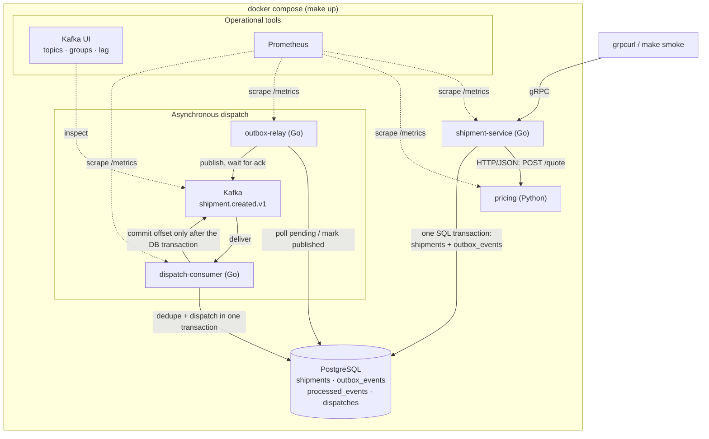

# ParcelLab

ParcelLab is a small, fictional parcel-quoting and shipment service used for a
45-minute technical pairing interview. Everything in this repository (code,
schema, sample data, business rules) was written for the exercise.

A client asks for a quote, creates a shipment, and later sees that the shipment
was *dispatched*. Quoting is synchronous. Dispatch is asynchronous: an event
travels through a transactional outbox, Kafka, and a consumer that writes the
dispatch record.



## Before the interview

Base tools, installed however you normally manage tools (go.dev tarball,
Homebrew, asdf, mise, distro packages): `git`, `make`, Go 1.27, `uv`, and a
container engine (Docker with the Compose plugin, or Podman, see below).
`make doctor` checks for them and prints where to get anything missing; it
never installs anything itself.

Everything else the project needs (`protoc` 36.1, `protoc-gen-go` 1.36.12,
`protoc-gen-go-grpc` 1.6.2, `grpcurl` 1.9.4) is fetched by `make tools` into
the repository's own `./bin` (gitignored) and nowhere else, so it cannot
collide with versions you have installed elsewhere. Targets that need one of
those tools fetch it on first use. The versions are pinned in the `Makefile`
and match the headers of the committed `gen/` files; other versions produce a
header-only diff that `make generate-check` flags. No host Python or `protoc`
is required; the Python service runs in its container and `uv` runs its tests.

```sh
make doctor   # base tools present? prints install hints for anything missing
make tools    # fetch protoc, protoc-gen-go, protoc-gen-go-grpc, grpcurl into ./bin
make pull     # download the third-party images ahead of time (optional; `make up` does it too)
make up       # build + start everything; waits until healthy (~1-2 min first time)
make smoke    # end-to-end check; must print SMOKE PASSED
make test     # Go + Python unit tests
make help     # every other target, grouped by purpose
```

Host ports do not need to be free. `make up` checks every published port
first (`make ports` shows the same check without changing anything); a port
held by another process is swapped for the next free one and the choice is
recorded in `.env`, which Compose and every Makefile target read. `make urls`
prints the effective addresses. To force a specific port, set it in `.env`
(`make env-init` creates the file); to return to a default, delete its line.

**Podman.** The Makefile uses `docker compose` when `docker` is on `PATH` and
`podman compose` otherwise (`CONTAINER_CLI=podman make up` forces it).
`podman compose` delegates to the `docker-compose` binary when that is
installed, and that path is expected to work: the stack uses
`depends_on: condition: service_completed_successfully` for the migration and
topic-init one-shots, which the Python `podman-compose` project does not
implement. Install `docker-compose` next to Podman (Homebrew, distro package,
or the GitHub release) and start the machine (`podman machine start`) before
`make up`. This path has not been exercised by the maintainers; tell us if it
misbehaves.

**Windows.** Use WSL2 (Ubuntu) with Docker Desktop's WSL integration and run
everything inside the WSL shell; the Makefile and `tools/` assume a Unix shell.

If anything fails, reach out before the interview; the timed session assumes a
green `make smoke`.

## Commands

Everything you need to run lives in the `Makefile`; `make` (or `make help`)
lists the targets by section. The ones you will use most:

| Command | What it does |
|---|---|
| `make doctor`, `make tools` | Check base tools and print install hints; fetch the pinned protoc/grpcurl toolchain into `./bin`. |
| `make up` / `make down` / `make reset` | Start / stop the stack. `down` keeps the data volumes; `reset` deletes them. |
| `make ports` | Which host port each service will use and whether it is free, ours, or taken. |
| `make ps`, `make logs`, `make logs-service` / `logs-pricing` / `logs-relay` / `logs-consumer` | Container status; follow logs of all four application services or one of them. |
| `make test` | `go vet` + `go test -race` and `pytest`. No stack needed. |
| `make test-integration` | Storage tests against the running Postgres (`parcellab_test` database). |
| `make lint` | `go vet`, `gofmt`, and a check that `gen/` matches the proto. |
| `make smoke` | gRPC health → quote → create → Kafka record → dispatch → replay → metrics → Prometheus. |
| `make generate` | Regenerate `gen/` from `proto/parcellab/v1/shipment.proto`. After any code change, `make up` rebuilds and redeploys the images (`make restart` does not rebuild). |
| `make quote`, `make create`, `make get SHIPMENT_ID=…` | The three RPCs via `grpcurl`. `WEIGHT_GRAMS=` and `CORRELATION_ID=` override the defaults; `REQUEST_JSON='{…}'` sends any request body, so the targets keep working once you extend the contract. |
| `make replay EVENT_ID=evt_…` | Republish an existing outbox event with the same event ID. |
| `make psql`, `make sql Q="…"`, `make sql-shipment SHIPMENT_ID=…`, `make sql-dispatch-counts`, `make sql-pending`, `make sql-processed`, `make sql-event EVENT_ID=…` | Look at the database. The same queries are in `docs/queries.sql`. |
| `make kafka-topics`, `make kafka-messages`, `make kafka-lag` | Topic layout, every record with key and headers, consumer-group offsets and lag. |
| `make metrics`, `make prometheus-targets` | The `parcellab_*` series from every service; Prometheus scrape health. |
| `make kafka-stop` / `kafka-start`, `make pricing-slow` / `pricing-normal`, `make pricing-stop` / `pricing-start`, `make poison-event` | Failure scenarios; see "Guarantees and known limitations". |

Default local addresses (all bound to 127.0.0.1; `make urls` prints the
effective ones, which differ when a default was taken or `.env` overrides it):

| What | Where |
|---|---|
| gRPC API | `127.0.0.1:50051` (reflection enabled) |
| Management HTTP: shipment-service / relay / consumer | `:8080` / `:8081` / `:8082` → `/healthz`, `/readyz`, `/metrics` |
| Pricing service | `http://127.0.0.1:8000` → `POST /quote`, `/healthz`, `/metrics` |
| Kafka (host listener) | `127.0.0.1:19092` |
| Kafka UI | http://127.0.0.1:8085 |
| Prometheus | http://127.0.0.1:9090 |
| PostgreSQL | `127.0.0.1:5432`, user/db `parcellab`, password `parcellab_dev_password` |

## Example requests

```sh
make grpc-list                     # grpcurl -plaintext 127.0.0.1:50051 list parcellab.v1.ShipmentService

make quote WEIGHT_GRAMS=1500
# grpcurl -plaintext -d '{"weight_grams": 1500}' 127.0.0.1:50051 parcellab.v1.ShipmentService/GetQuote
# {"price": {"amountCents": "700", "currency": "USD"}}

make create WEIGHT_GRAMS=1500 CORRELATION_ID=req_demo_1
# grpcurl -plaintext -H 'x-correlation-id: req_demo_1' -d '{"weight_grams": 1500}' \
#   127.0.0.1:50051 parcellab.v1.ShipmentService/CreateShipment
# shipment with outboxStatus PENDING and dispatch.status PENDING

make get SHIPMENT_ID=shp_…
# a moment later: outboxStatus PUBLISHED, dispatch.status DISPATCHED, dispatch.eventId evt_…

make sql-shipment SHIPMENT_ID=shp_…   # stored price, outbox state, dispatch row
make kafka-messages                   # the record: key shp_…, headers, JSON payload
make replay EVENT_ID=evt_…            # consumer logs "duplicate event ignored"
make sql-dispatch-counts              # still exactly one dispatch per shipment
```

Pricing rules (standard delivery): 500 cents + 100 cents per *started*
kilogram, weight 1–30 000 g, currency USD. 1 500 g → 700 cents.

## Where things live

| Path | Role |
|---|---|
| `proto/parcellab/v1/shipment.proto` | The gRPC contract. `gen/` holds the committed Go bindings. |
| `internal/shipmentapi` | gRPC handlers, validation, error → status mapping, request metrics. |
| `internal/pricing` | HTTP/JSON client for the pricing service: bounded timeout, error classification. |
| `pricing/app/pricing.py`, `pricing/app/main.py` | Pricing rules (pure) and the FastAPI app. Tests in `pricing/tests`. |
| `internal/domain` | Typed IDs, `Money`, weight validation. No I/O. |
| `internal/events` | `shipment.created` payload: encode, strict decode, topic and header names. |
| `internal/storage` | PostgreSQL: create shipment + outbox in one transaction, claim/mark outbox, dedupe + dispatch. |
| `db/migrations` | Versioned SQL schema. Applied by the `migrate` one-shot on `make up`. |
| `internal/relay`, `internal/consumer`, `internal/broker` | Outbox relay loop, dispatch consumer, franz-go wrapper. |
| `cmd/*` | One `main.go` per binary: `shipment-service`, `outbox-relay`, `dispatch-consumer`, `migrate`, `replay`, `smoke`. |
| `internal/app`, `internal/config`, `internal/observability`, `internal/correlation` | Bootstrap, env config, logger/metrics/management server, correlation IDs. |
| `docker-compose.yml`, `Dockerfile`, `pricing/Dockerfile`, `deploy/` | The stack. |
| `Makefile`, `tools/ports`, `tools/protoc` | Every command you need; free-port selection that runs before `compose up`; the checksummed `protoc` fetcher behind `make tools`. |
| `docs/queries.sql` | SQL to inspect a shipment end to end. |

## How a shipment flows

1. `CreateShipment` validates the weight, calls `POST /quote` on the pricing
   service (2 s bound, `PRICING_TIMEOUT`), then inserts the shipment **and** its
   `shipment.created` outbox event in one transaction. The RPC returns here.
   Kafka is not on this path.
2. `outbox-relay` claims pending rows (`FOR UPDATE SKIP LOCKED`), publishes
   each to `shipment.created.v1` keyed by shipment ID, waits for the broker's
   acknowledgment, then marks the rows published in the same transaction.
3. `dispatch-consumer` reads one record at a time per partition. For each it
   inserts the event ID into `processed_events` and the dispatch into
   `dispatches` in one transaction, **then** commits the Kafka offset.
   A redelivered event ID is recognised and ignored.
4. `GetShipment` joins the three tables and reports outbox and dispatch state.

The event payload:

```json
{
  "event_id": "evt_c5ab215fc77c543e",
  "event_type": "shipment.created",
  "schema_version": 1,
  "shipment_id": "shp_61acde58edb7a77c",
  "occurred_at": "2026-09-15T18:17:56Z",
  "correlation_id": "req_smoke_181756",
  "data": { "weight_grams": 1500, "amount_cents": 700, "currency": "USD" }
}
```

The correlation ID enters as gRPC metadata `x-correlation-id` (generated when
absent), is forwarded to pricing as `X-Correlation-ID`, stored in the payload,
carried as a Kafka header, and appears on every log line in all four services.

## Guarantees and known limitations

- **At-least-once, not exactly-once.** If the relay crashes after the broker
  acknowledged an event but before the row is marked, the event is published
  again with the same `event_id`. The consumer's `processed_events` table is
  what makes that harmless. `make replay` reproduces this on demand.
- **`CreateShipment` is not idempotent.** A client retry creates a second
  shipment. There is no idempotency-key feature.
- **No dead-letter queue** (`make poison-event`). A malformed or unsupported
  record is logged with its partition and offset, counted in
  `parcellab_consumer_events_total`, and stops the consumer without committing
  the offset (Compose restarts it; `make kafka-lag` and Kafka UI show the
  uncommitted record as persistent lag on that partition). Skipping is a
  deliberate non-choice for the baseline. Recovery is a destructive
  `make reset && make up`; discussing a better answer is part of the interview.
- **Kafka down** (`make kafka-stop` / `make kafka-start`): shipment creation
  keeps working; events accumulate as pending (`make sql-pending`,
  `parcellab_outbox_pending_events`), the relay logs failures, and everything
  drains when the broker returns.
- **Pricing slow or down:** the RPC fails with `DEADLINE_EXCEEDED`
  (`make pricing-slow`, undo with `make pricing-normal`) or `UNAVAILABLE`
  (`make pricing-stop`, undo with `make pricing-start`) within the bound;
  nothing is stored.
- **Local simplifications:** plaintext connections, one broker, RF 1,
  development credentials in `docker-compose.yml`. None of this is production
  configuration.

## Metrics worth looking at

| Metric | Source |
|---|---|
| `parcellab_grpc_requests_total{method,code}`, `parcellab_grpc_request_duration_seconds` | shipment-service |
| `parcellab_pricing_requests_total{outcome}` (ok, rejected, unavailable, timeout, canceled) | shipment-service |
| `parcellab_outbox_published_total`, `parcellab_outbox_publish_failures_total`, `parcellab_outbox_pending_events` | outbox-relay |
| `parcellab_consumer_events_total{outcome}` (processed, duplicate, malformed, unsupported, conflict, failed) | dispatch-consumer |
| `pricing_quotes_total{outcome}` | pricing |

No metric carries a shipment ID, event ID or correlation ID as a label.

## The interview task

You will receive the task description at the start of the session. It extends
this baseline: the proto, the Go service, and the pricing service each change
a little, and you verify the result through the whole stack (Kafka UI,
Postgres, replay, Prometheus). There is no pre-work beyond a green
`make smoke`. There are no deliberately failing tests.
